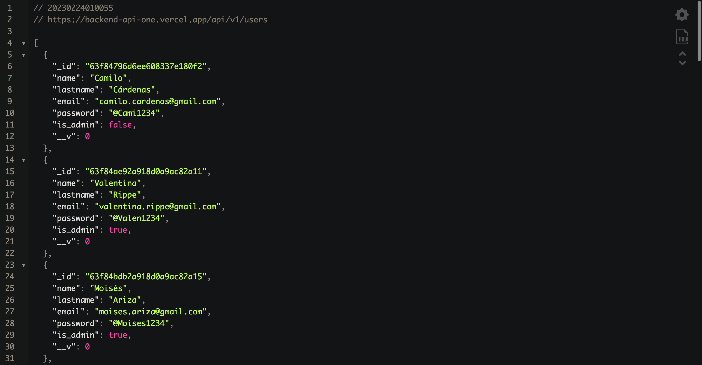

# UsersAPI from Cohort 7 at Educamás-GOYN

A users list from Cohort 7 at Educamás-GOYN app made with Node, Express and MongoDB.

## Screenshots



To retrieve users information from backend go to the next link:  

Author: Camilo Cárdenas

A simple and easy-to-use users API that helps you organize users from Cohort 7 and keep track of them.

Features

+ Create new users registers with different information
+ Edit and delete existing users

## Usage

To use Users-API from Cohort 7 at Educamás-GOYN, simply follow these steps:

+ Go to the UsersAPI from Cohort 7 at Educamás-GOYN URL
+ See the previous users registered
+ Create a new register by entering a name, lastname, email, password, and if it is_admin.

## Installation

1. `cd API`
2. `npm install`
3. `npm run dev` or `nodemon index`

### Note

This app is aimed to be for testing only and is NOT meant to be deployed to production. It lacks request validation, security checks, error handlers and a lot more.

## Getting Started

It comprises of `MongoDB`, `Express`, and `Node`.

## Development

### Installed Packages

+ `npm init -y`, this creates package.json file
+ `npm install -D nodemon` to be able to see changes instantly without reinitializing the server (hot reloading).
+ `npm i express`, to use this thin framework
+ `npm install mongoose cors`
+ Create index.js file, this will contain all connection information
+ Create user.js in models folder this will create or fetch user
+ Use postman (or thunderclient a visual studio extension for verifying connection right from visual studio).

Then we created several scripts to agilize development

```json
    "scripts": {
        "dev": "nodemon index.js",
        "start": "node index.js",
        "lint": "eslint"
    },
```

### Getting MongoDB Connection

Open Connect and click on - Connect your Application

  

Copy and Add your connection string into your application code

  

## Documentation

To be able of make a proper documantation, we use JSDoc wich is library for make documentation easier with comments.

+ npm i jsdoc

After the instalation we create an archive named: jsdoc.json to configurate the pluggin
